# Data Analysis for 2014 to 2017 Ottawa Calgary and Toronto

- The goal is perfrom a Cluster analyizing the datasets to gain insights of total 300 GB datasets

## Data Preprocessing
- During 2014 in Ottawa, the following table shows the accident count of different impact types:
  - 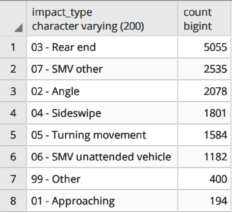
    - Collision impact types visualization via SQL table
  - We picked the top 4 types (Rear end, Angle, Sideswipe and SMV other) to analysis, because the higher the accident number, the more accurate and meaningful the conclusion we can draw.

  - Now as an example of how we did cluster analysis, lets take only the impact type of Rear end, after that, the analysis processes of other impact types are similar.

  - To analyze the rate of frequency, we only need two dimensions (which was approved by the professor) to do cluster analysis (coordinates X and Y). Because these numbers are very clean in the source file of 2014, we did not do any data cleaning process. We just use min-max method to normalize these coordinates (because X is around 350000 and Y is around 5000000)
    ```python
      collision_2014 = pd.read_csv(
          './2014collisionsfinal.csv', low_memory=False)
      scaler = preprocessing.MinMaxScaler()

      rear_end = collision_2014[collision_2014.Impact_type ==
                                '03 - Rear end']

      x_norm, y_norm = scaler.fit_transform(rear_end.X.values.reshape(-1, 1)),\
          scaler.fit_transform(rear_end.Y.values.reshape(-1, 1))

      rear_end['X_norm'] = x_norm
      rear_end['Y_norm'] = y_norm

      rear_end[['X_norm','Y_norm']].to_csv('./norm_x.csv',index=False)
    ```
## Model construction and Algorithm that is used
- The idea is finding a groups of locations or streets with high rate of frequency. Thus DBSCAN is a reasonable method (also because the number of dimensions is only 2, not high). For example, a street with high rate of accident frequency is likely to have dense points along it, therefore, when running DBSCAN, the area of a cluster will spread alone the street.
    - 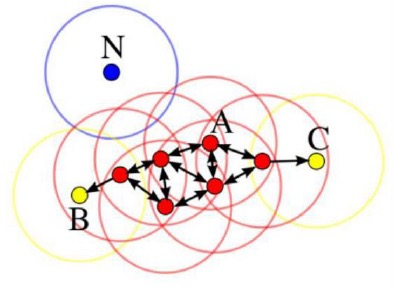
      - DBScan Algorihtm visualization. Clustering B A to C

- After obtained the cluster, to find the streets (or intersections) of high rate of accident frequency, we just need to count the number of accidents in every street (or intersection) in the cluster, then the top N frequently occurring street (or intersection) in the cluster are the streets (or intersections) of high rate of accident frequency. Finally, if we carry out the same process to every cluster we found (except the cluster for outliers), we can get all of the groups of locations or streets (or intersections) with high rate of frequency

    - 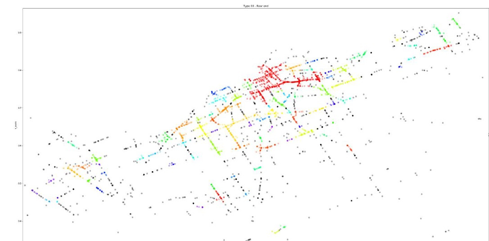
      - Plotted result of the datasets. This is fairly similar to Ottawa's map

## Model evaluation and finding the best parameters of DBSCAN

- Since DBScan is unsupervised learning and we clustered based on distance, so we use Silhouette Coefficient to evaluate the clustering result.

  - 
    - Formula for DBScan
- $a(i)$ is the average distance from point $i$ to the other points in the same cluster,
Let $b(i,j)$ be the average distance from point $i$ to all of the points in another cluster $C(j)$, then we can get $b(i) = $min \{ b(i_1), b(i_2), b(i_3), b(i_4), b(i_5) … b(i_k)\}$
$s(i) (-1,1)$, the higher $s(i)$ is, the more reasonable our clustering result is
    ```
      ===================
      ===================
      Current silhouette_score is
      0.07149377325615387
      ===================
    ```
- To find the best parameters
  ```python
    ## Find the best parameters using Silhouette Coefficient
    ##### Already using the best parameters ######
    ##### Time consuming, please uncomment following block is you want to use ######
    ##### ==================
    ##### ==================
    ##### the best silhouette_score is:
    ##### 0.07149377325615387
    ##### whose parameters [eps,min_samples] are:
    ##### [0.005500000000000001, 10]
    ##### ==================
    ##### ==================
    p_eps = .001
    scores_scaled = []
    score_information = []
    for p_min_samples in range(10,50):
        while p_eps < .01:
            labels = DBSCAN(
                eps = p_eps,
                min_samples = p_min_samples,
                n_jobs = -2 # Use all CPUs except 1
            ).fit(X).labels_

            score = metrics.silhouette_score(X, labels)
            scores_scaled.append(score)
            score_information.append([p_eps,p_min_samples])
            p_eps += .0005

    max = max(scores_scaled)
    index = scores_scaled.index(max)

    print('==================')
    print('the best silhouette_score is:')
    print(max)
    print('whose parameters [eps,min_samples] are:')
    print(score_information[index])
    print('==================')
    print('==================')

    ###### End of the block ######
    ##############################
    ##############################
  ```
  - code sample in `phase3.py`
- The outputs of top 300 results

  - 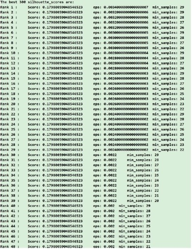

- However, the combinations with the highest score are not always the best combinations we need, when the “eps” is very low or the “min_samples” is very high, the result cannot let us get good conclusions.

  - For example, using the best combination
    - For impact type of angle: `eps=.0034, min_samples=29`
  - As a comparison, picking an appropriate combination
    - `(eps=.0084, min_smaples=5,)` for rnak 64 in the combinationof parameters
    - 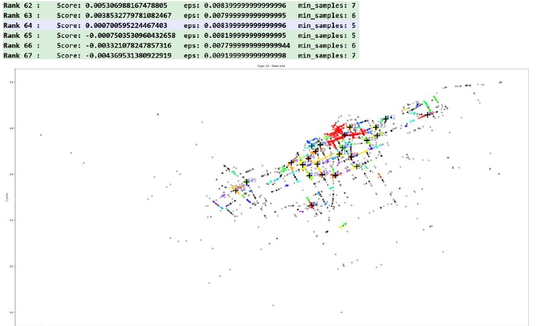
      - Highest clustering location in Ottawa. The `+` is the centroids of every cluster groups.

## Statistics Analysis
- For every impact type, we did a cluster analysis, then for the biggest five clusters of each impact type, we did some statistics for every cluster.
Basically, we did three kinds of statistics:
  1. Sort the street names with the highest accidents
  2. Sort the intersections with the highest accidents
  3. Sort the Street-Name, Intersection-1 and Intersection-2 combinations with the highest accidents.

- As the following shows:
    ```
    ======================================================================================
                                   street_name  count
    8                              HIGHWAY 417    282
    12                     HWY417 IC118 RAMP35     77
    20                             BRONSON AVE     74
    2                         ST. LAURENT BLVD     72
    104                    HWY417 IC117 RAMP51     59
    ..                                     ...    ...
    231                               HENEY ST      1
    228                            CHESTNUT ST      1
    226  E.B. EDDY N / 148 N OF MIDDLE ST/E.B.      1
    225                     208 N OF MIDDLE ST      1
    316                        OLD SUNSET BLVD      1

    [317 rows x 2 columns]
    ======================================================================================

    ======================================================================================
    Intersection-1         Intersection-2
     HWY417 IC118 RAMP57    HWY417 IC118 RAMP35       37
     HWY417 IC118 RAMP35    HWY417 IC117 RAMP51       34
     HWY417 IC117 RAMP26    HWY417 IC117 RAMP61       29
     HWY417 IC117 RAMP51    HWY417 IC117 RAMP35       25
    INDUSTRIAL AVE          RIVERSIDE DR              22
                                                      ..
    BOOTH ST                ORANGEVILLE ST             1
    BESSERER ST             CUMBERLAND ST              1
    BERNARD ST              QUEEN MARY ST              1
    BEECHWOOD AVE           SPRINGFIELD RD             1
     148 N OF MIDDLE ST    E.B. EDDY S / MIDDLE ST     1
    Length: 350, dtype: int64
    ======================================================================================

    ======================================================================================
    Street-Name   Intersection-1         Intersection-2
    HIGHWAY 417    HWY417 IC118 RAMP57    HWY417 IC118 RAMP35                         37
                   HWY417 IC118 RAMP35    HWY417 IC117 RAMP51                         34
                   HWY417 IC117 RAMP26    HWY417 IC117 RAMP61                         29
                   HWY417 IC117 RAMP51    HWY417 IC117 RAMP35                         25
    Unknown       INDUSTRIAL AVE          RIVERSIDE DR                                22
                                                                                      ..
    SUSSEX DR      LADY GREY DR           151 W OF KING EDWARD AVE/L.B. PEARSON BU     1
                   CLARENCE ST            YORK ST                                      1
    Unknown       JAMES ST                LYON ST                                      1
                  JOSEPH CYR ST           LEMIEUX ST                                   1
                  BOOTH ST                ORANGEVILLE ST                               1
    Length: 356, dtype: int64
    ======================================================================================
    ```
## Knowledge discovered

- Following are the visualization of centroids of top 4 impact types
  1. `Single Motor Vehicle`
    - 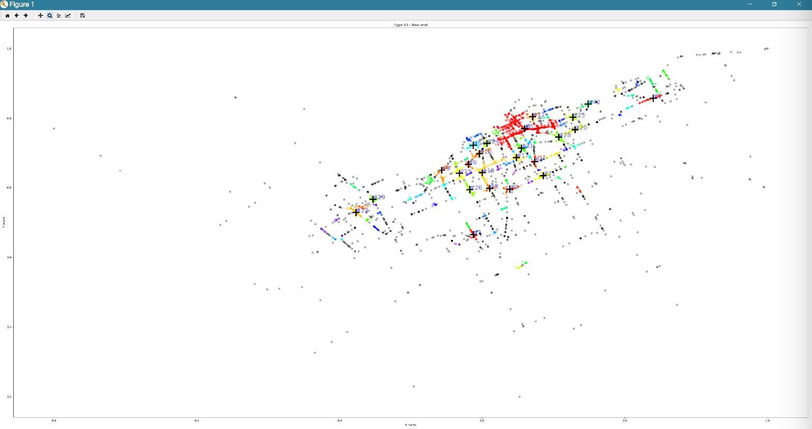
  2. `Angle`
    - 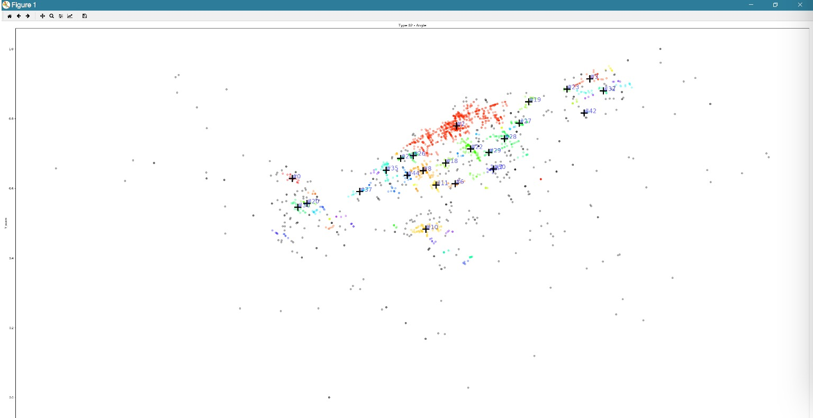
  3. `Turning Moment`
    - 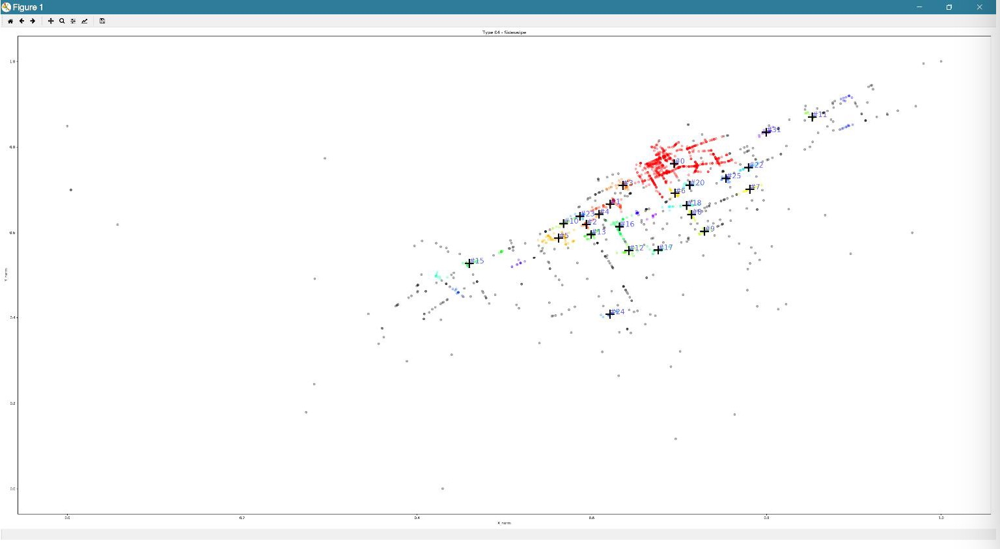
  4. `Rear End`
    - 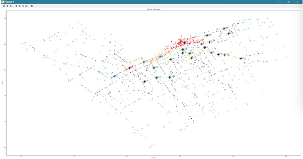
## Interesting Conclusion And Insights

- After compared the visualization results and statistical information, we discovered following knowledge:
  1. Highway417 is the most frequent
    - 
      - As some other study suggested from [Global News](https://globalnews.ca/news/5912395/fatal-collision-eastbound-lanes-hwy-417/)
  2. For all of the four impact types, the closer to the center of Ottawa city, the denser the clusters of accidents distribute, which means the more likely an accident will occur. Maybe it is because there are more vehicles in the downtown area. The distribution of SMV – other accidents is more dispersed than the three other types, we speculate it maybe because the influence of vehicle density for SMV – other is not as strong as the influence for other accidents.

  3. Most accidents are around the area of Centre Town and Orchard Park.
    - 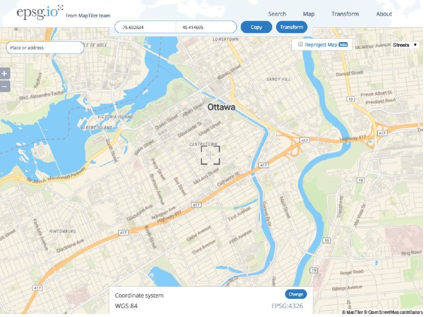

  4. For the four impact types, the most dangerous streets are Highway 417, Bank treet, the intersection of Baseline Road and Merivale Road. Streets West Hunt Club Rd., Merivale Road and Walkley Road, intersections of Longfields Dr. and Strandherd Dr., Hightway 416 and Fallowfield Rd are dangerous, too.

  5. For impact types of rear end, angle and side swipe, the Hunt Club Rd. between Riverside Drive and Prince of Wales Dr. is very dangerous. The centroid of cluster #5 of rear end, cluster #6 of angle and cluster #17 of side swipe are on the bridge on the Hunt Club Rd, as the following screenshot show
    - 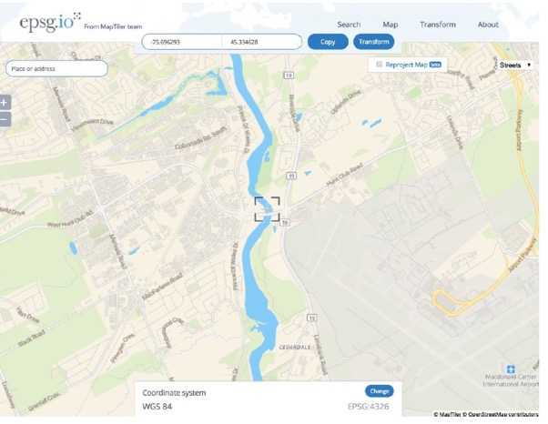
  6.  The accidents of **angle** seem likely to occur at intersections, whereas other three types of accidents are likely to occur along streets. Because the shapes of clusters of angle accidents are “rounder” than other three types, but the shapes of other three types tend to reveal the structure of a (or some) street(s).

# Conclusion
1. The parameters calculated by formulas are not always the best, we often need to adjust the parameters manually.

2. Visualization is very useful to adjust parameters. Initially we implemented visualization just to make the project fancier, but after we implemented it, we found visualization is very important for us to evaluate the effect of parameters and analyze data.

3. When we are analyzing data, many works seem in vain and the time was wasted, but actually these works helped us a lot to understand the data and requirements.

4. As group members, we learned a lot of things from each other, not only coding skills and technical knowledge, but also the ways of doing things.